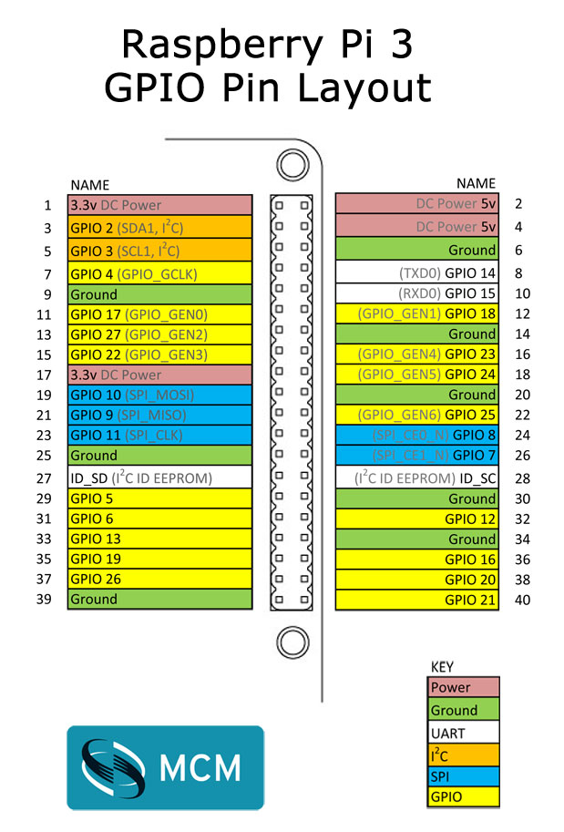

## Pin numbering

- physical board

- `libbcm2835`

[bcm2835 Documentation: Constants for passing to and from library functions](http://www.airspayce.com/mikem/bcm2835/group__constants.html#ga63c029bd6500167152db4e57736d0939)

## Wiring

|UCF LOC|FPGA引脚名 |FPGA端颜色 |树莓派端颜色   |BCM numbering  |Board numbering |WiringPi|
|:-----:|:---------:|:---------:|:-------------:|:-------------:|:--------------:|:------:|
|AB26   |JA_I[4]    |红         |红             |4              |7               |7       |
|AA25   |JA_O[4]    |橙         |橙             |17             |11              |0       |
|W24    |JA_I[3]    |黄         |黄             |18             |12              |1       |
|W21    |JA_O[3]    |绿         |绿             |27             |13              |2       |
|W23    |JA_I[2]    |蓝         |蓝             |22             |15              |3       |
|V21    |JA_O[2]    |黑         |黑             |2              |3               |8       |
|AB25   |JA_I[1]    |灰         |棕             |3              |5               |9       |
|W26    |JA_O[1]    |紫         |紫             |23             |16              |4       |

|UCF LOC|FPGA引脚名 |FPGA端颜色 |树莓派端颜色   |BCM numbering  |Board numbering |WiringPi|
|:-----:|:---------:|:---------:|:-------------:|:-------------:|:--------------:|:------:|
|AC21   |JD_O[3]    |棕         |紫             |20             |38              |28      |
|AB21   |JD_O[2]    |白         |灰             |21             |40              |29      |
|AC22   |JD_O[1]    |绿         |蓝             |16             |36              |27      |
